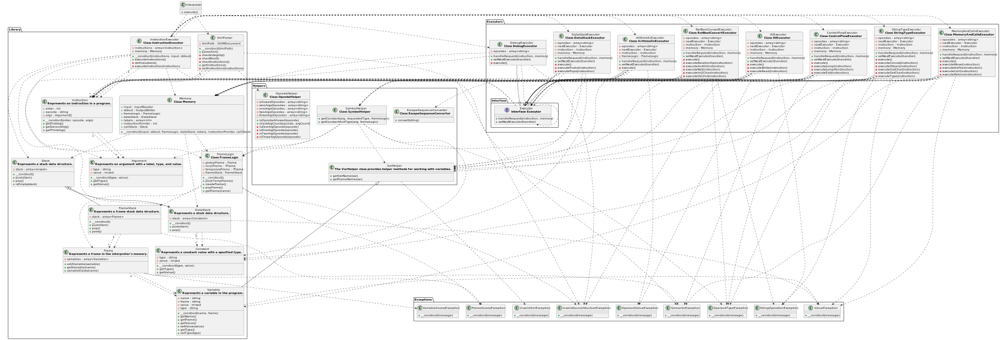

# Implementační dokumentace k 2. úloze do IPP 2023/2024

**Jméno a příjmení:** Ondřej Janečka

**Login:** xjanec33

## Úvod

Dokumentace popisuje způsob řešení druhé úlohy z projektu IPP 2024. Cílem úlohy bylo vytvořit interpret instrukcí uložených ve formátu XML, který je výstupem skriptu parse.py z první úlohy.

## Návrh

Navrhovaná implementace projektu je založena na principu objektově orientovaného programování (OOP) a využívá návrhový vzor řetězec odpovědnosti (**Chain of Responsibility**). Tento návrhový vzor se týká všech tříd implementujících rozhraní ```Executor``` v adresáři ```Executors```. Řetězec odpovědnosti umožňuje, aby se každá instrukce zpracovávala nezávisle na ostatních, což poskytuje flexibilitu a snadnou rozšiřitelnost systému. Každý objekt v řetězci odpovědnosti má možnost zpracovat požadavek nebo předat odpovědnost dalšímu objektu v řetězci, až je požadavek úspěšně zpracován nebo dosáhne konce řetězce. Retězec je vytvořený na základě odhadované četnosti jednotlivých instrukcí v programu s cílem o co nejefektivnější zpracování.

### UML diagram



### Sporné části

Implementace vyžaduje sdílení několika proměnných a instancí napříč celým programem, týká se to například instance třídy ```Interpreter``` nebo ```instructionPointer```. Z tohoto důvodu se po zpracování XML při vytváření instance třídy ```InstructionExecutor``` vytvoří i instance třídy ```Memory```, která uchovává všechny potřebné instance a proměnné. Následně je předávána jako argument v řetězci odpovědnosti. Zde by bylo možné implemntovat třídu ```Memory``` podle návrhového vzoru jedináček, ale z důvodu vetší přehlednosti kódu jsem se rozhodl právě pro předávání instance formou argumentu.

## Struktura kódu

Zdrojové kódy jsou rozděleny do čtyř adresářů.

- ```Exceptions``` - Rozšiřující třídy ```IPPException``` pro návrat chybových stavů programu.
- ```Executors``` - Třídy určené pro vykonání jednotlivých instrukcí, které jsou v nich seskupeny podle typů.
- ```Helpers``` - Pomocné statické funkce například pro převod escape sekvencí nebo získání názvů rámců a proměnných z argumentů instrukcí ...
- ```Library``` - Knihovna tříd definujících jednotlivé objekty programu.

## Testování a ladění

Testování bylo provedeno pomocí dodaných ukázkových automatických testů rozšířených o vlastní sadu testů vytvořených pomocí překladače z IFJ a parseru z první úlohy. Kód byl testován statickou analýzou pomocí nástroje PHPStan a splňuje požadavky pro úroveň 7.
